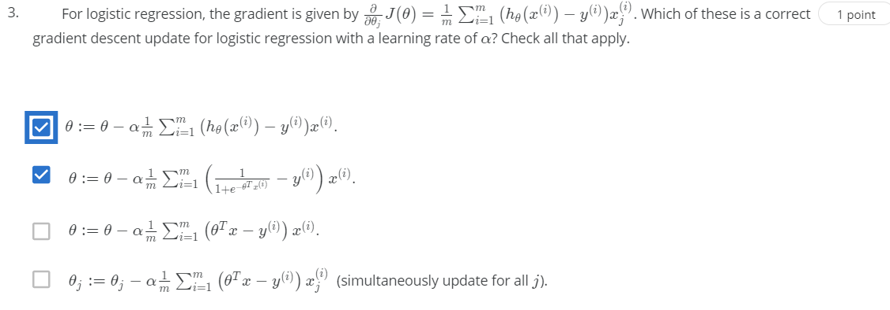

##Quiz Logistic Regression:

Question 1
Suppose that you have trained a logistic regression classifier, and it outputs on a new example x a prediction hθ(x) = 0.2. 
This means (check all that apply):
A. Our estimate for P(y=0|x;θ) is 0.2. (Incorrect)
B. Our estimate for P(y=0|x;θ) is 0.8. (Correct)
C. Our estimate for P(y=1|x;θ) is 0.8. (Incorrect)
D. Our estimate for P(y=1|x;θ) is 0.2. (Correct)

Question 2
Suppose you have the following training set, and fit a logistic regression classifier hθ(x)=g(θ0 + θ1x1 + θ2x2).
Which of the following are true? Check all that apply.
A. J(θ) will be a convex function, so gradient descent should converge to the global minimum. (Correct)
B. Adding polynomial features (e.g., instead using hθ(x)=g(θ0 + θ1x1 + θ2x2 + θ3x12 + θ4x1x2 + θ5x22)) could increase how well we can fit the training data. (Correct)
C. The positive and negative examples cannot be separated using a straight line. So, gradient descent will fail to converge. (Incorrect)
D. Because the positive and negative examples cannot be separated using a straight line, linear regression will perform as well as logistic regression on this data. (Incorrect)

Question 3

 